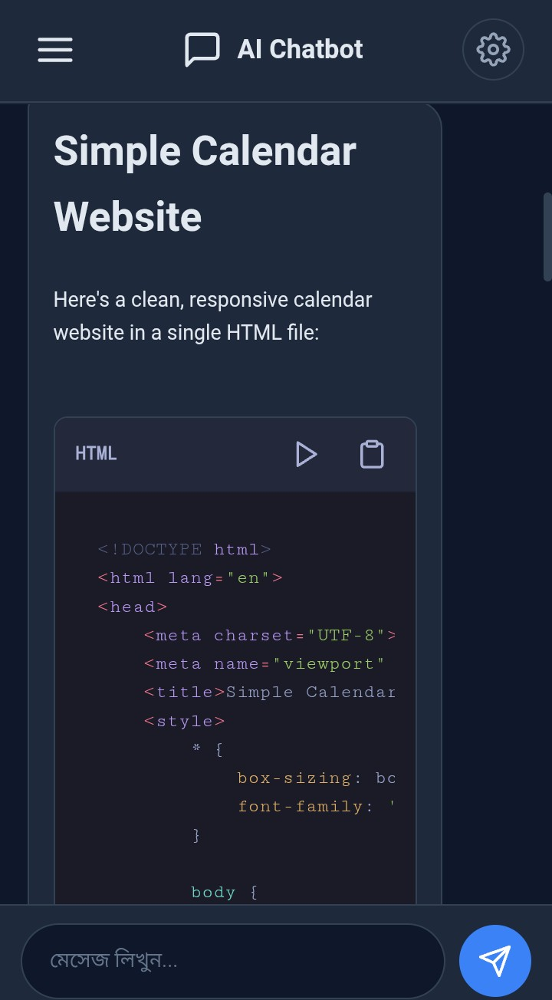
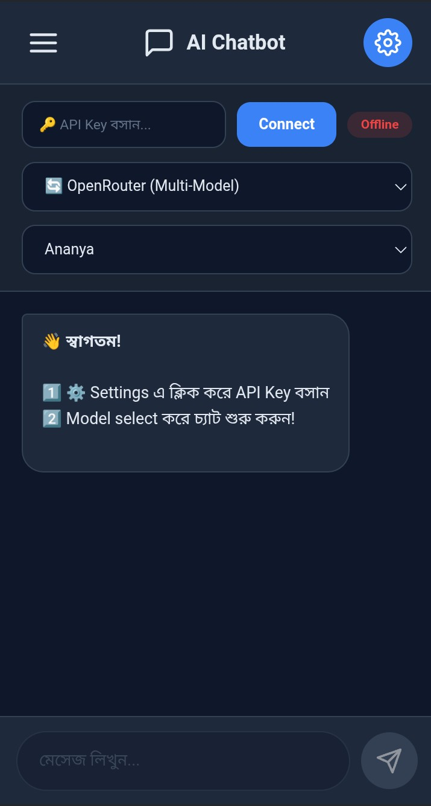
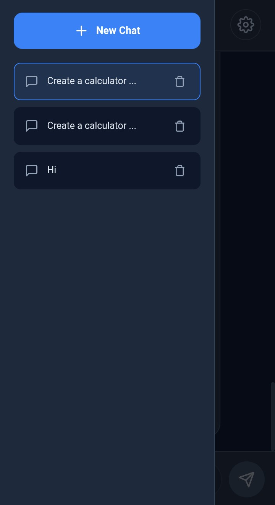
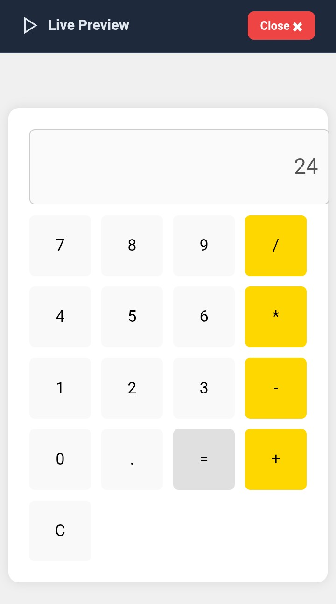

# 🤖 AI Chatbot - Multi Provider

A modern, serverless, and highly customizable AI Chatbot built with pure HTML, CSS, and JavaScript. It supports multiple AI providers directly from the browser!

## ✨ Key Features
- **Multi-Provider Support:** Switch seamlessly between OpenRouter, OpenAI, Groq, Google Gemini, and Anthropic Claude.
- **Local Chat Memory:** All your chats are automatically saved in your browser's `localStorage`. You can manage multiple chat sessions easily.
- **Live Code Preview:** Not just a copy button! It comes with a built-in "Run Code" feature that instantly previews HTML/CSS/JS codes in a modal iframe.
- **Markdown & Syntax Highlighting:** Beautifully formats AI responses and highlights code blocks using `marked.js` and `highlight.js` (Tokyo Night Dark Theme).
- **Serverless & Secure:** No backend required. API keys are stored locally and sent directly to the providers.
- **Responsive Design:** Looks great on both desktop and mobile devices.
### 📸 Screenshots

   
  <b>Chat Interface &nbsp; &nbsp; &nbsp; &nbsp; &nbsp; &nbsp; &nbsp; &nbsp; &nbsp; &nbsp; Setting Panel</b> 
  
  

  <b>Chats Bar &nbsp; &nbsp; &nbsp; &nbsp; &nbsp; &nbsp; &nbsp; &nbsp; &nbsp; &nbsp; &nbsp; &nbsp; &nbsp; &nbsp; Live Preview</b> 
  
  

## 🚀 How to Use
1. Clone the repository or simply download the ZIP.
2. Open `index.html` in your favorite browser.
3. Click the ⚙️ Settings icon.
4. Select your preferred provider (e.g., OpenRouter for free models like DeepSeek/Qwen).
5. Enter your API Key and hit "Connect".
6. Start chatting!

## 🛠️ Built With
- Pure HTML, CSS, JavaScript
- `marked.js` (Markdown parsing)
- `highlight.js` (Syntax highlighting)

## 💡 Pro Tip
When asking for website code, the AI is programmed (via system prompt) to provide the HTML, CSS, and JS combined into a single file, so you can test it instantly using the "Run Code" button!

---
*If you find this project useful, please consider giving it a ⭐!*
